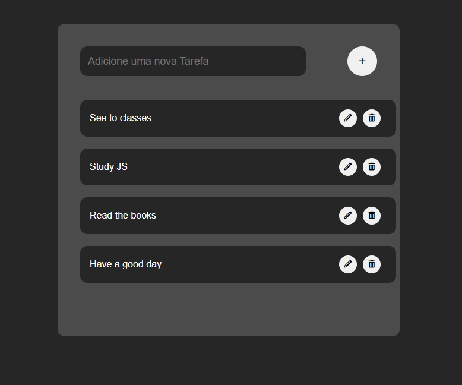
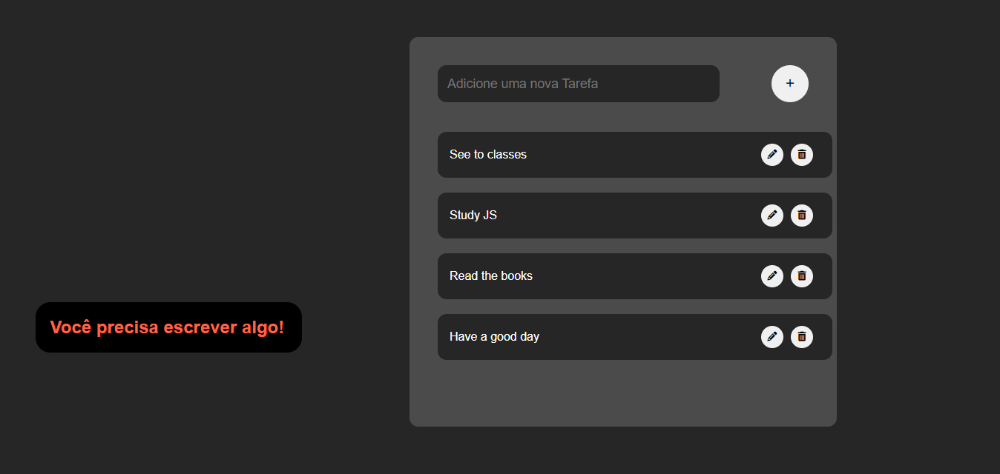

<h1 align="center"> To-do List em JavaScript </h1>

  <a href="#-tecnologias">Tecnologias</a>&nbsp;&nbsp;&nbsp;|&nbsp;&nbsp;&nbsp;
  <a href="#-projeto">Projeto</a>&nbsp;&nbsp;&nbsp;|&nbsp;&nbsp;&nbsp;
  <a href="#-mudança">Mudança</a>

 

  

## 🚀 Tecnologias

Esse projeto foi desenvolvido com as seguintes tecnologias:

- HTML e CSS
- JavaScript

## 💻 Projeto

Um To-do list (Lista de afazeres), pequeno projeto para treino, fixação de JavaScript.
Projeto feito pelo [Douglas Horstmann](https://www.youtube.com/@odouglasdev).

## 📌 Mudança

  

No projeto inicial, é usado o próprio alert do navegador, mas como mudança, decidi fazer um alert para quando você não escrevesse nada.

By Kauã Monteiro 🪐
